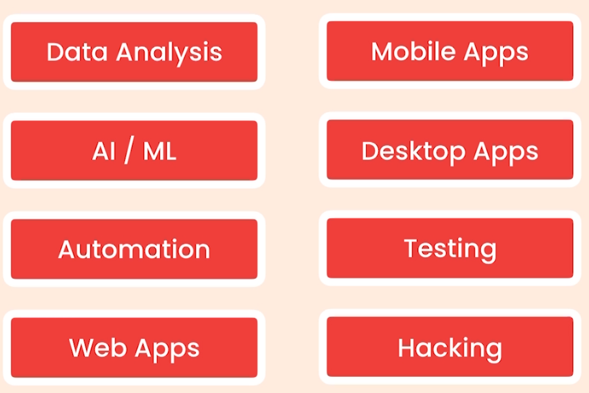
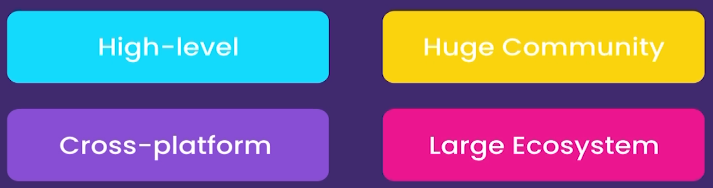
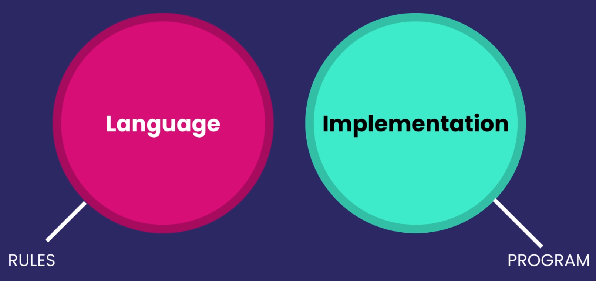

# Python

Python is a `high-level`, versatile programming language known for its simplicity and readability, making it a favorite among beginners and professionals alike. Created by `Guido van Rossum` and first released in `1991`, Python supports multiple programming paradigms, including `procedural`, `object-oriented`, and `functional` programming. Its extensive standard library and active community provide tools for diverse applications, from web development and data analysis to artificial intelligence and scientific computing. Python’s concise syntax enables developers to write code efficiently, enhancing productivity while maintaining clarity. As a result, it has become a cornerstone in modern software development, data science, and machine learning.

# A Python Programing full Crash cours in Kadoos EDU

# Getting started

- About Python

  - The World's Fastest growing programming language
  - Most Popular among Software Engi., Data Analysts, Math, Science, Net Engi., and Kids
  - Google, Facebook, Spotify, DropBox, and etc. use Python
  - Python is simple
  - 
  -
  - Python is a multipurpose Language
  -
  - 
  -
  - Most Desirable language
  - 
  -
  - Python2 and Python3
  -

- Installation Instruction

  - Install python (Download and install)
  - Note "check `Add python 3 to PATH`"
  - check your installation on windows Command prompt

- Python Interpreter

  - Check some code in it
  - Check errors

- Editors

  - Text Editors `Notepad` , `Atom`, `Sublime`
  - IDEs `Pycharm`,
  - Use `VSCode` for this class

- Create Your First Python File

  - Open your folder in VSCode And create .py file
  - Talk about extensions
  - First Built-in Function `Print()`
  - Execute first code in terminal

- Turn VSCode to a Powerful IDE Using Extensions

  - Install python Extension in VSCode
  - 
  - Install Linter to find Potential errors
  - Select right Python for your Project

- PyLint

  - Check PyLint Functionality
  - Check errors in problems panel
  - Talk about command pallet `Shift + ctrl + p`
  - Choose Right linter - `pylint`

- Python Enhancement Proposal

  - PEPs In google
  - Talk about PEP8
  - Talk about Python code formats
  - Format Document In command pallet
  - `autopep8` Installation
  - Talk about some developer mistake in formatting code
  - Turn auto format on save in `Code>Preferences>sittings`
  - Search for FormatOnSave and turn it on

- Running Python Code

  - Install Code Runner
  - Running Code by Key or `ctrl+alt+n`

- Python Implementation

  - 
  - Cpython and python interpreter
  - Other Implementations of python Jython, IronPython, PyPy
  - These implementations help us to use other languages code in our python code
